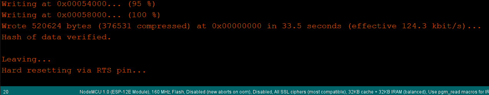

# ParkDeck

## Description
ParkDeck is MethodPark's version of a streamdeck. With it you can control desktop applications on your pc or send macros for all number of purposes!


In this repository you can find all information on how to build a ParkDeck. The code and the Readme are set up to control Spotify streaming.

## Prerequisite

- **Arduino IDE with a version > 2.0**
- You can check the version of your Arduino IDE by navigating to the topbar in the IDE and selecting `Help` -> `About Arduino IDE`
- Download and install the Arduino IDE following the instructions for your OS, [here](https://www.arduino.cc/en/software)

## Assembly

Place the ESP dev module on the PCB and solder it in place.


Flip it and place the switches and potentiometer on the PCB and solder them.


Place the LCD in the front half of the case. Don't forget to remove the protective peel beforehand!


Place the PCB into the front half of the case and align the LCD pins. Then solder it in place.


Slide the two halves of the case together.


Choose and put the switch caps of your choice and put the potentiometer knob in place.


The hardware assembly is now done!

## Setup
- Clone this repository and open the .ino file in the Arduino IDE
- Install the following libraries by navigating to `Sketch` -> `Include Library` -> `Manage Libraries` or press `CTRL` + `SHIFT` + `I` and type in the name of the libraries:
	- `TFT_eSPI` by Bodmer
	
	- `TJpg_Decoder` by Bodmer
	
	- `ArduinoJson` by Benoit Blanchon
	
- Go to the [filesystem plugin for ESP8266 repository](https://github.com/earlephilhower/arduino-littlefs-upload) and follow the installation instructions and then come back after restarting the IDE

At this point, all neccessary libraries should be installed. Next, we want to connect the ParkDeck and check that everything is working.

- Plug in your assembled ParkDeck
- In the IDE, navigate to `File` -> `Preferences`, look for `Additional Boards Manager URLs` or press `CTRL` + `,` and click the popup icon at the end of the line. Add the URL `http://arduino.esp8266.com/stable/package_esp8266com_index.json` and confirm your settings.


- Navigate to `Tools` -> `Board` -> `Boards Manager...`, and install the `esp8266`
- Navigate to `Tools` -> `Board` -> `ESP8266 Boards` and select `NodeMCU 1.0 (ESP-12E Module)`
- Set `Tools` -> `CPU Frequency` to `160mhz`
- Navigate to `Tools` -> `Port` and select the correct port. This depends on where you've plugged in the ParkDeck. Find the right port by selecting one (e.g. `COM7`) and try to upload the sketch using the arrow icon in the toolbar. A success looks like this:

- Now you can upload the data inside the `data` folder in this repository to the ESP. Use the command `[Ctrl] + [Shift] + [P], then "Upload LittleFS to Pico/ESP8266/ESP32"` and wait for it to finish. Note: make sure that no serial monitor or serial plot is open in order for this tool to work.

Next, we need to make a few configuration changes to the libraries we've installed to make the display work.

- Open the Arduino TFT library installation folder. On Windows, it is located at `Documents\Arduino\libraries\TFT_eSPI`
- Open the `User_Setup_Select.h` file in an editor of your choice
- Add `//` in front of line 27 (`// #include <User_Setup.h)` to comment the line and uncomment by removing the `//` in line 30 to include the `User_Setups/Setup2_ST7735.h` and save your changes

- Next, open the `Setup2_ST7735.h` file in an editor of your choice located in the folder `User_Setups` and change line 11 from `#define ST7735_REDTAB` to `#define ST7735_GREENTAB`.
- Add `#define TFT_SPI_OVERLAP` after `TFT_HEIGHT` in line 9
- Uncomment line 16 `#define TFT_RGB_ORDER TFT_RGB  // Colour order Red-Green-Blue`
- In the same file, replace lines 20 - 22 with the correct pins and save the file:
```
#define TFT_CS   PIN_D3  // Chip select control pin D8
#define TFT_DC   PIN_D8  // Data Command control pin
#define TFT_RST  PIN_D6  // Reset pin
#define TFT_MISO  PIN_MISO  // MISO
#define TFT_MOSI  PIN_MOSI  // MOSI
#define TFT_SCLK  PIN_SCLK  // CLK
```


Congratulations! Everything should be correctly set up. The only thing left is to make sure that your ParkDeck is connected to your WIFI and make sure it works.

- In the ParkDeck.ino file edit lines 40 and 41 to your WIFI_SSID and PASSWORD.
	> Note: SSIDs are case sensitive.
- Upload the code to the ParkDeck

If it worked the screen should show its personal IP adress once the ParkDeck has rebooted.


## Spotify setup
- Go to https://developer.spotify.com/documentation/web-api and follow the instructions there to create a new app.
- When asked for a redirect URI enter `http://YOUR_ESP_IP/callback`, where `YOUR_ESP_IP` is the IP displayed on the screen of the ParkDeck in the step before.
- In the Spotify app there are client_ID as well as client_Secret, copy these to line 44 and 45 in the ParkDeck.ino file.
- Also enter the IP adress from above as `YOUR_ESP_IP` in line 46.
- Push the code once more in Arduino IDE and once your ParkDeck reboots navigate in a web browser to the IP displayed and follow the instructions.

It's done! Now you can start Spotify and enjoy the control you have with your new ParkDeck!

## Notes

- You have to authenticate on each usage (each restart)
- Skip backwards works only after the songs is playing a few seconds, the ParkDeck needs to load the album art etc.

## Original source
Credit goes to https://gitlab.com/makeitforless/spotify_controller for the idea and framework.
